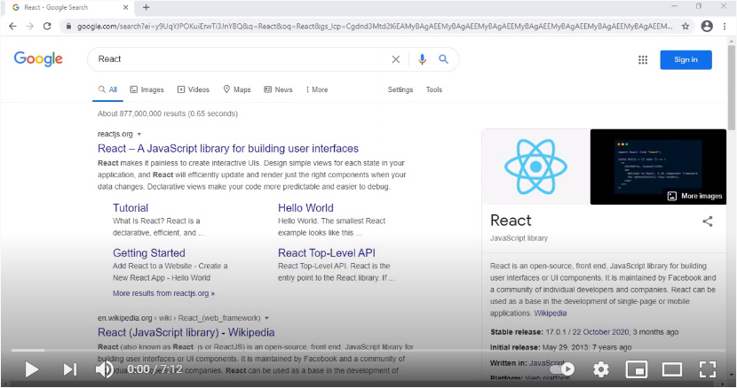

# online-electronics-store
DeviceShop is a web application (SPA) which is an online store for saling electronic devices.

This program is written using PERN stack (React, MobX, Node.js, Express, Sequelize and PostgreSQL).

<h3>To see how this web application works watch the demo video below.</h3>

<strong>DeviceShop:</strong>

